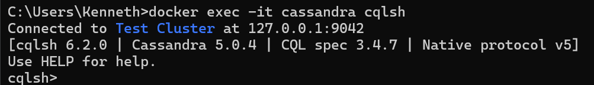
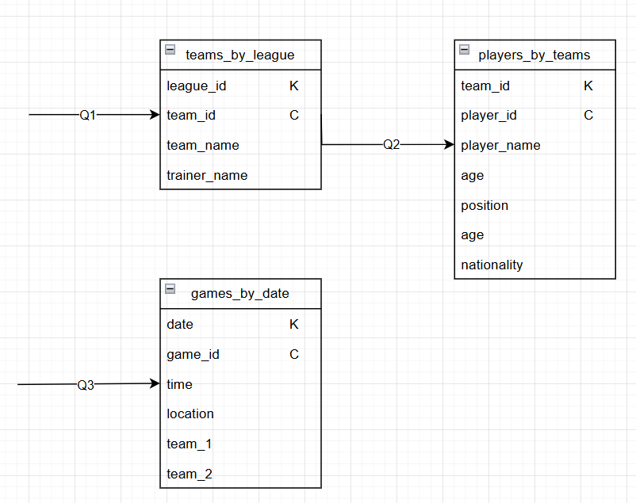

# A) 

# B) 

## Q1
Bei Q1 , will man eine Query machen, welche alle Teams in einer bestimmten Liga herausfindet. Die Partition Key ist die league_id und der cluster key wäre team_id.

## Q2
Für Q2, entscheiden wir uns auf ein team, um Informationen über alle Spieler dieses Teams zu erhalten. Die Partition key ist team_id und als Cluster key die player_id.

## Q3
Die dritte Abfrage (Q3) soll Spiele an einem bestimmten Datum finden. Hier ist das Datum (date) die Partition key und cluster key ist game_id, da es ja sein könnte, dass es mehrere games an einem tag hat.

# C)
CQL Skript: [Physische](physisch.sql)