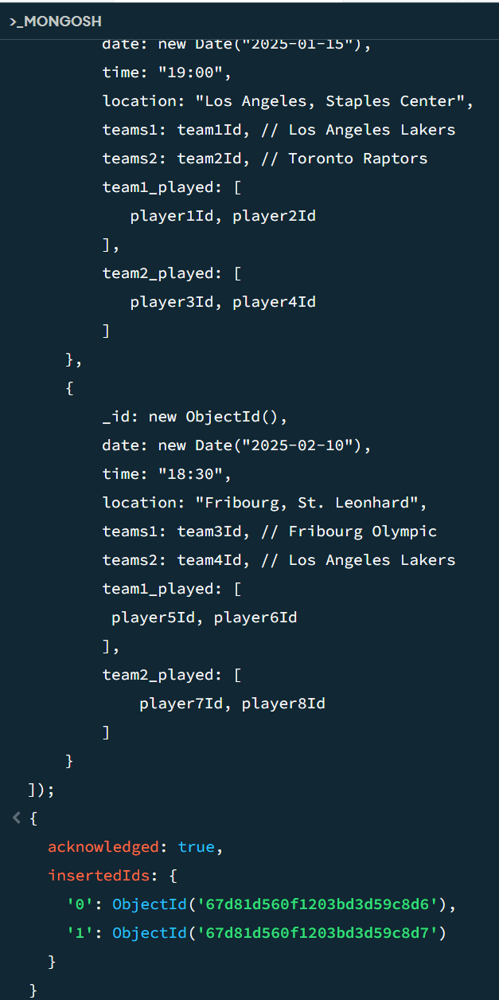
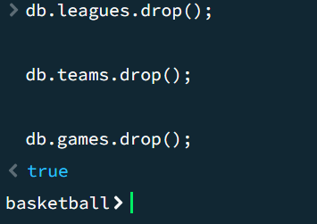
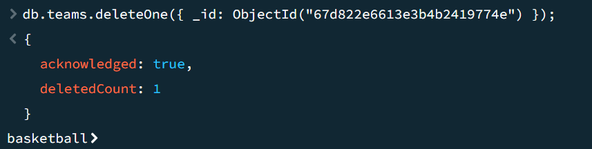
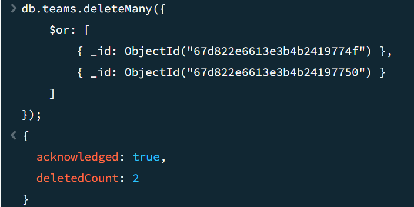
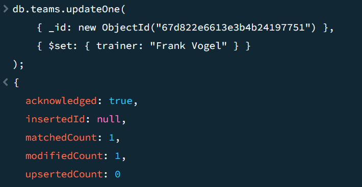
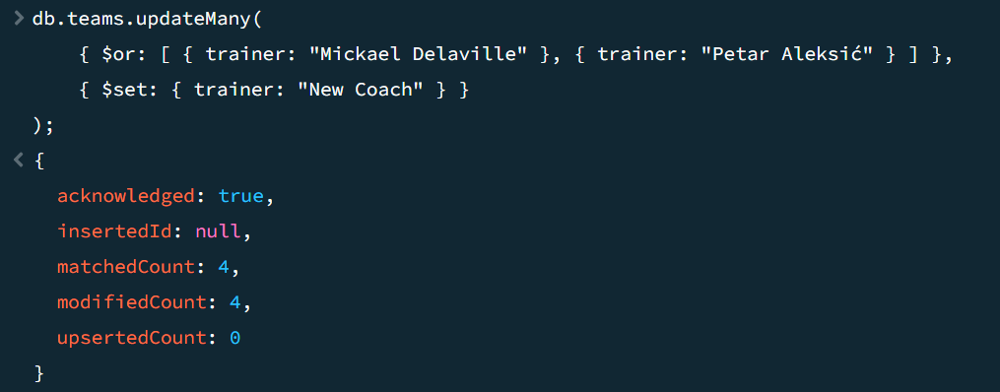

# KN-M-03

# A)
Script Datei für Inserts:
[Insert_Script](KN03_insert.js)

Output von Abfrage:

# B)

## Delete ALL:
Script:
[DeleteAll](DeleteALL.js)

Resultat:

## Delete one und many:
Script: [Script_2_Delete](2Delete.js)

Resultate:

# C) 
[Daten Abfragen](DatenAbfragen.js)

# D)
[Update](UPDATE.js)

Resulatat:

