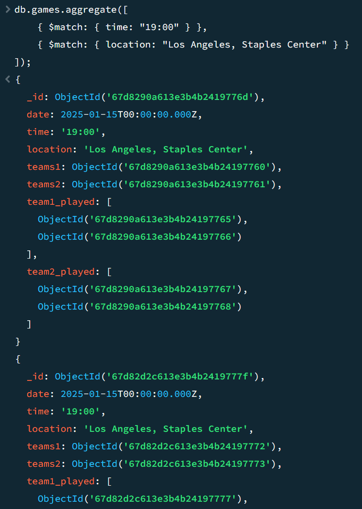
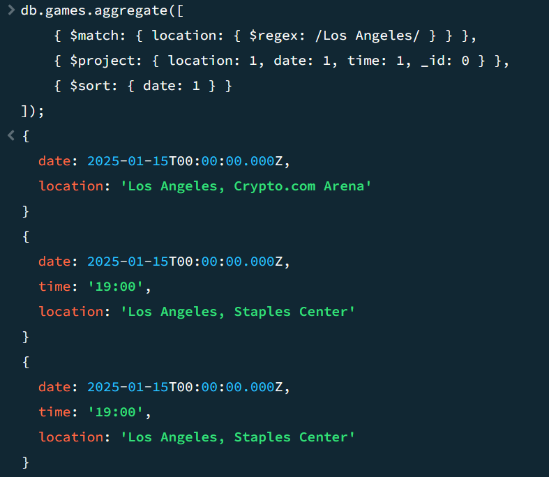
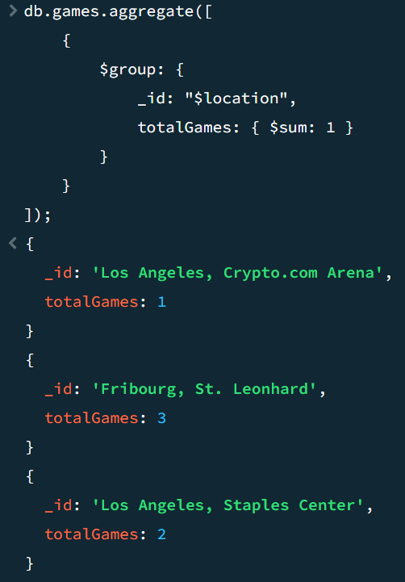
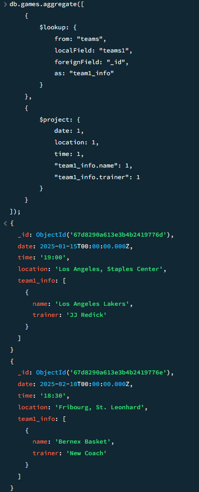
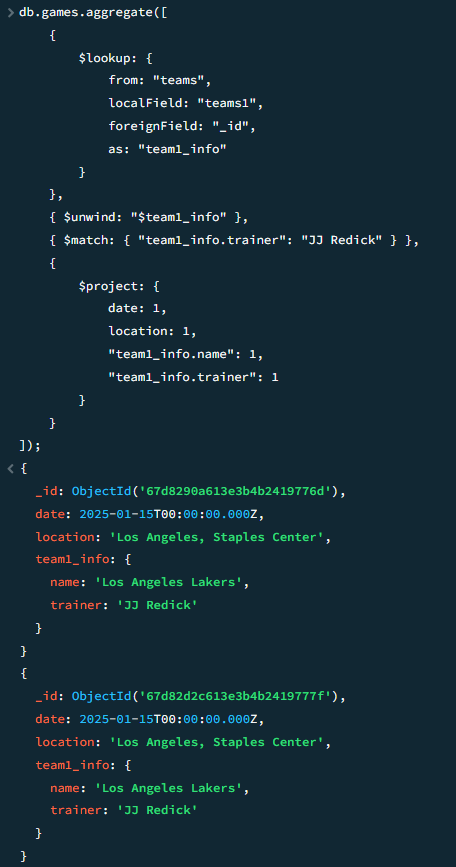
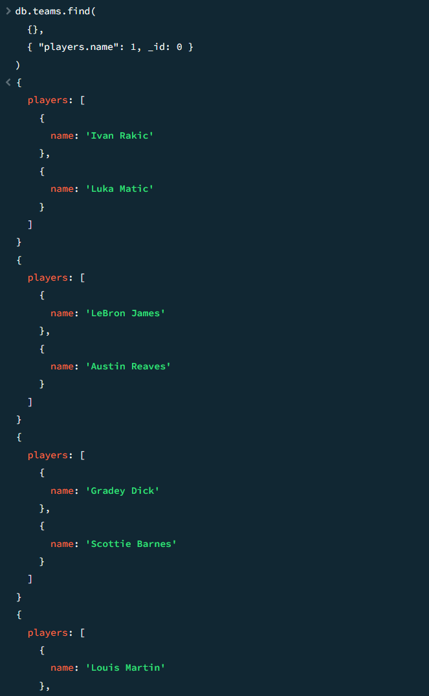
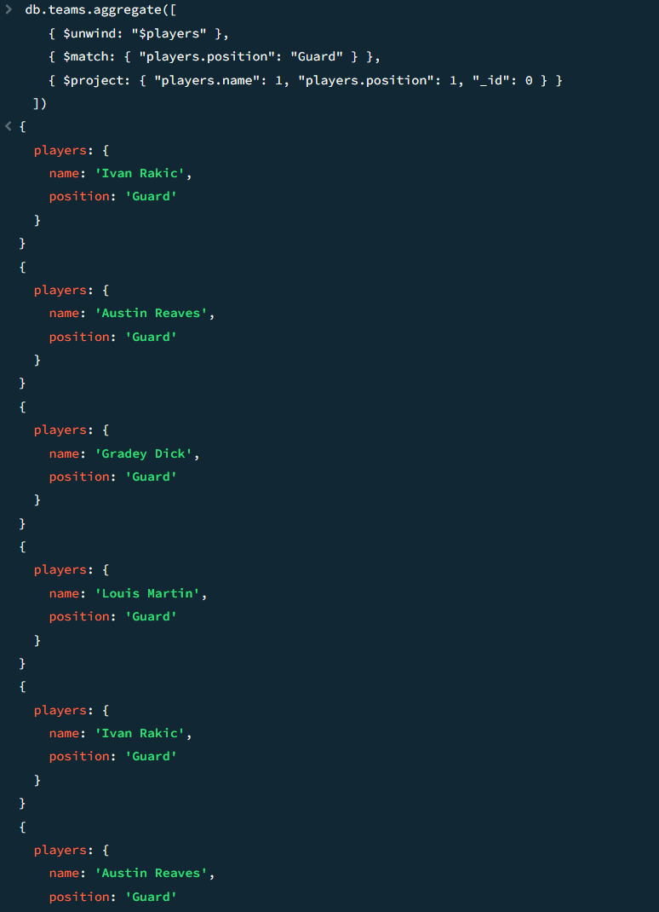

# KN-M-04

## A) Aggregationen

Skript: [Aggregationen](Aggregationen.js)

$match (UND):

$match, $project, $sort:

$group, $sort: 

## B) JOIN
Skript: [JOIN](JOIN.js)

$lookup mit games und teams: 

$lookup & $match mit games und teams: 

## C) Unterdokument

Skript: [Unterdokument](Unterdokumente.js)

Einfache Abfrage, die nur einzelne Felder der Unterdokumente ausgibt.

Eine Abfrage, die nach Feldern von Unterdokumenten filtert. ($unwind)

