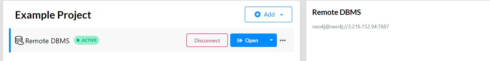
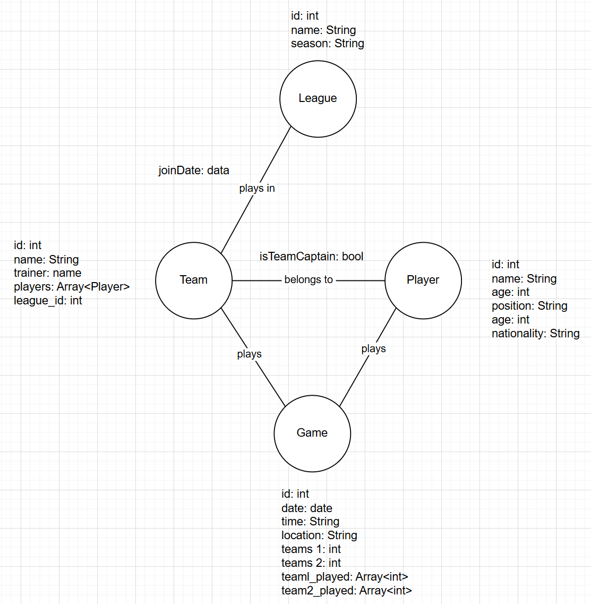

# KN-N-01: Installation und Datenmodellierung für Neo4j

## A) Installation / Account erstellen (30%)

## B) Logisches Modell für Neo4j (70%)      

### Kanten Attribute:
Zwischen Team & Player: isTeamCaptain(bool)
Zwischen League & Team: joinDate(date)
