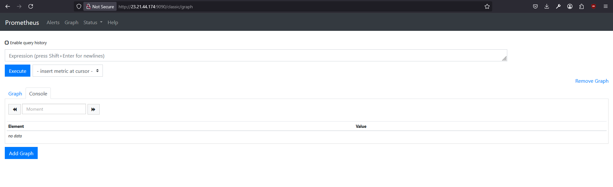

# A)





# B)

### Was sind Scrapes? Erklären Sie den Begriff im Zusammenhang mit Prometheus und geben Sie konkrete Beispiele.
Scrapes sind sozusagen requests, welche von Prometheus gemacht werden, um Metrikdaten von targets zu holen.
In diesem Bsp. werden Requests alle 15 Sekunden an localhost:9090 und localhost:9100 gesendet.


### Was sind Rules? Erklären Sie den Begriff im Zusammenhang mit Prometheus und geben Sie konkrete Beispiele.
Es gibt zwei Arten von rules: 
- Recording rules (metriken berechen oder zusammenfassen)

```- record: node_memory_MemFree_percent
              expr: 100 - (100 * node_memory_MemFree_bytes / node_memory_MemTotal_bytes)```

Er berechnet hier den freien Speicher in Prozent. 


- Alerting rules (alarme auslösen)
 ```- alert: InstanceDown
              expr: up == 0
              for: 1m
              labels:
                serverity: critical
              annotations:
                summary: "Instance {{ $labels.instance }} down"
                description: "Instance {{ $labels.instance }} of job {{ $labels.job }} has been down for more than 1 minute."
```
Hier erstellt es einen Alarm, also wenn eine Instanz für 1 MInute down war. 


### Was sind die Schritte, die Sie als Programmierer ausführen müssen, um eigene Daten in Prometheus zu speichern?
- Exporter verwenden, welche Metriken anbietet
- Dieser Endpoint in prometheus.yml eintragen


### Welche Variablen werden verwendet in den Scrapes und Rules und von welchen Seiten/URLs kommen diese Variablen?
job_name: name von Job (prometheus und node), metriken werden von dort gesammelt
targets: die URLS, von denen Prometheus Metriken abruft

record: name der neu berechneten metrik
expr: führt Berechnungen und benutzt dabei gescrapte Metriken
alert: name des alerts
up == 0: Ziel ist nicht erreichbar


### Wie weiss Prometheus, ob ein System up ist (siehe Regeln bei den Alerting Rules).
Prometheus macht regelmässige Request auf seine targets. Für jeden target erzeugt es die Metrik up. Wenn der Abruf = 1 ist, war es erfolgreich und bei 0 nicht erfolgreich. Im alerting rule steht bei expr: up == 0, also wenn es für eine Minute up == 0 ist, dann wird der Alarm ausgelöst.
